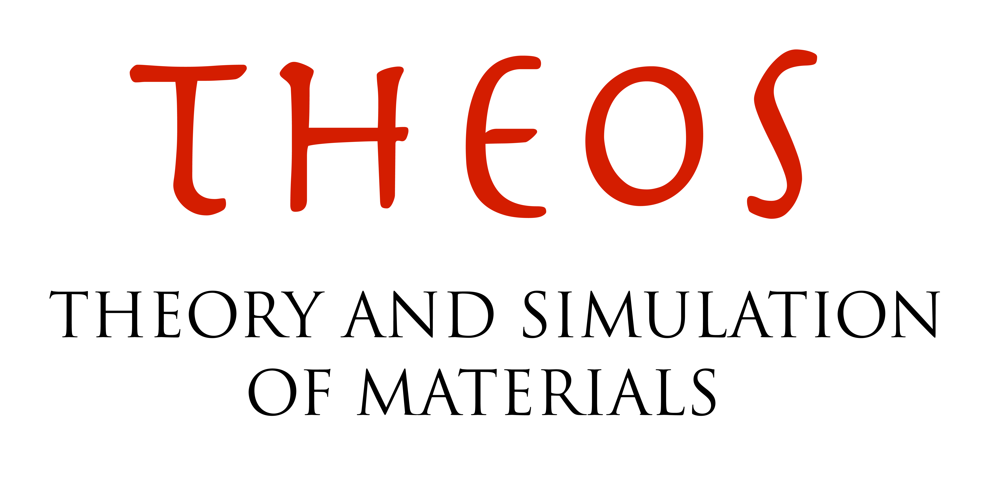

# OPTIMADE Gateway

A REST API server acting as a gateway for databases with an OPTIMADE API, handling the distribution and collection of a single query to several different OPTIMADE databases.

- Design: [design.md](docs/design.md)

## License, copyright & funding support

All code in this repository was originally written by Casper Welzel Andersen (@CasperWA).
The design for the gateway as outlined in [design.md](docs/design.md) was a joint effort between Casper Welzel Andersen (@CasperWA) & Carl Simon Adorf (@csadorf).

All files in this repository is [MIT licensed](LICENSE) with copyright (c) 2021 Casper Welzel Andersen & THEOS, EPFL.

### Funding support

This work was funded by [THEOS](http://theossrv1.epfl.ch), [EPFL](https://epfl.ch) and [the MarketPlace project](https://www.the-marketplace-project.eu/).

The MarketPlace project is funded by [Horizon 2020](https://ec.europa.eu/programmes/horizon2020/) under H2020-NMBP-25-2017 call with Grant agreement number: 760173.

    
